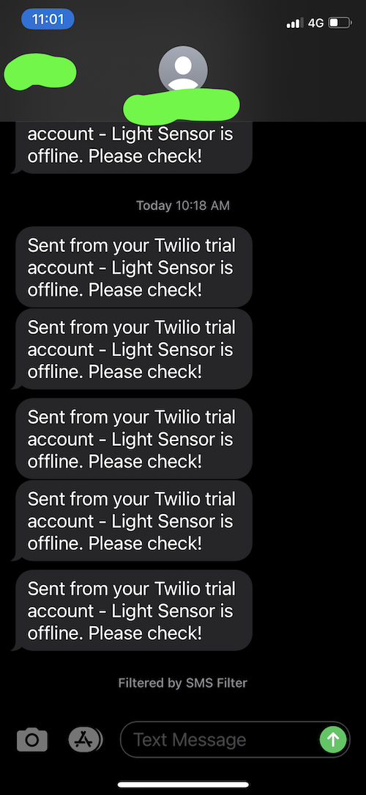

# Light Intensity Detection and SMS Alerts

My first project (self-initiated) in iOT

## Problem Statement

Using Bolt-iOT device, interface an LDR with cloud monitoring so that if the light intensity goes too high or too low, the customer can get an SMS alert on their mobile phones

## Technologies used

1. iOT:
 1. Bolt-iOT Platform ([www.boltiot.com](https://www.boltiot.com))
 2. Bolt-iOT Wifi Module
2. Cloud Monitoring
 1. Digital Ocean droplet ([www.digitalocean.com](https://www.digitalocean.com))
3. SMS Service
 1. Twilio ([www.twilio.com](https://www.twilio.com))
4. Python 3.x

## Approach
  An LDR light sensor is paired with a 330 Ohm resistor in series. This combination is powered by a 3.3V power supply. The junction of the two components is connected to the analog pin A0 of the iOT module. The analog pin would give output in the range of 0 through 1023. The iOT module is connected to the Wifi internet and is registered with the Bolt platform. The platform then provides an API Key and Device Name that can be used for external cloud services to communicate to Bolt modules.

   A droplet in Digital Ocean's terminology is a compute node similar to EC2 in AWS or Compute VMs in GCP. A droplet was configured with Ubuntu and Python. 
 
  In order for alerts to be pushed via SMS, Twilio service was used. This service provides a unique identifier, SID, and a source telephone number from which the SMS appears to be sent

   The maximum and minimum thresholds for light intensity is configured in the code. The python code is run in an infinite loop checking for the light levels every 10 seconds. SMS alerts are sent for the following scenarios:
 1. Connectivity issue between Bolt cloud and the iOT device
 2. Connectivity issue between Digital Ocean and Bolt Cloud
 3. Light intensity reading crossing the maximum and minimum thresholds

 The light intensity was varied using a handheld flashlight in order to cause the alerts to be generated
 
 Here is a high level architecture diagram of this system:
 

## Code
````

from boltiot import Sms, Bolt
import json, time
import conf 


max_light = 800
min_light = 100

my_bolt = Bolt(conf.API_KEY, conf.DEVICE_NAME)

sms = Sms(conf.SID, conf.AUTH_TOKEN, conf.TO_NUMBER, conf.FROM_NUMBER)


light_response_counter = 0
online_response_counter = 0
while (True):
 response =  my_bolt.isOnline()

 print("is online = ", type(response), response)

 json_response = json.loads(response)
 print("is online json=", json_response)
 if (json_response['value'] == 'offline'):
  response = sms.send_sms('Light Sensor is offline. Please check!')
  #print('Twilio response =', response)
 elif (json_response['success'] == 0):
  # There may be a network issue between this box and Bolt cloud
  online_response_counter += 1
  if (online_response_counter > 5):
   # send an sms for loss of communication with Bolt cloud
   response = sms.send_sms('There may be an issue with Bolt cloud, will continue to retry')
   #print('Twilio response =', response)
 else:
  online_response_counter = 0
  light_response = my_bolt.analogRead('A0')
  light_response = json.loads(light_response)
  print('light repsonse = ', light_response)
  if (light_response['success'] == 0):
   light_response_counter += 1
   if (light_response_counter > 5):
    response =sms.send_sms('Could not get light reading from sensor although it shows as being online')
    #print('Twilio response =', response) 
  else:
   light_response_counter = 0
   # the sensor shows 1024 for no light and 0 for fully illuminiated light
   light_response_value  = 1024 - int(light_response['value'])
   print('Light value =', light_response_value)

   if (light_response_value > max_light): 
    response = sms.send_sms('Too much light, value=' + str(light_response_value))
    #print('Twilio response = ', response)
   if (light_response_value < min_light):
    response = sms.send_sms('Very less light, value=' + str(light_response_value))
    #print('Twilio response= ', response)
 time.sleep(10)
````

## Outputs and Screenshots:

### Connections of the iOT Module


### Terminal outputs


### SMS Alerts
Device Connectivity alert:



Light Intensity alerts:


